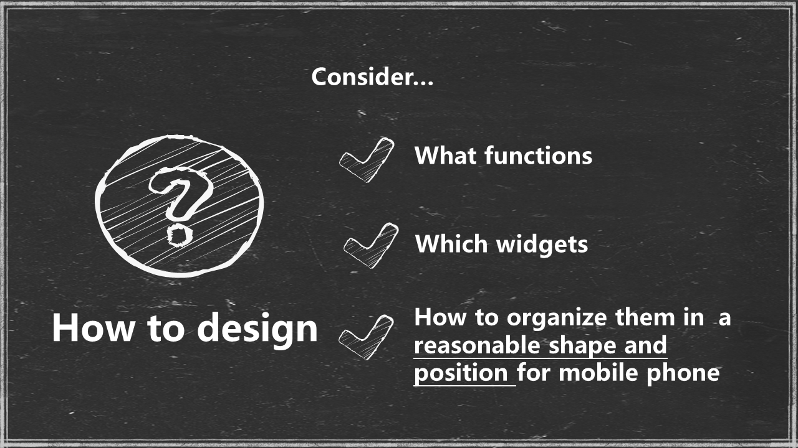
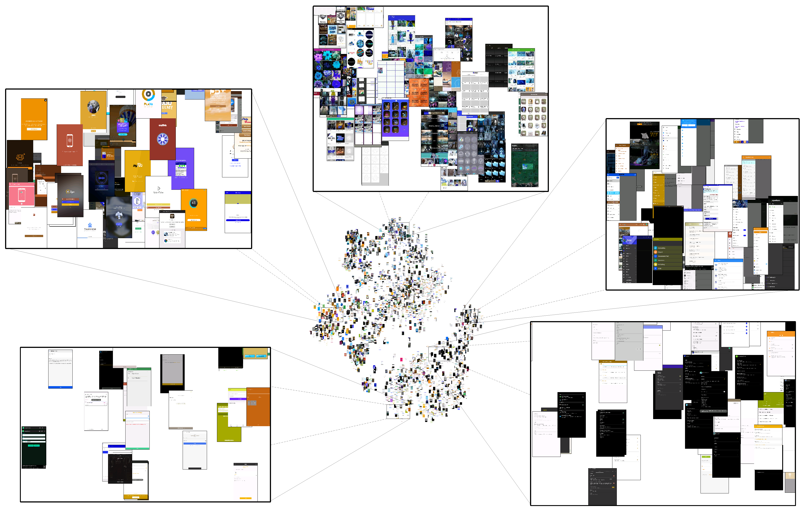
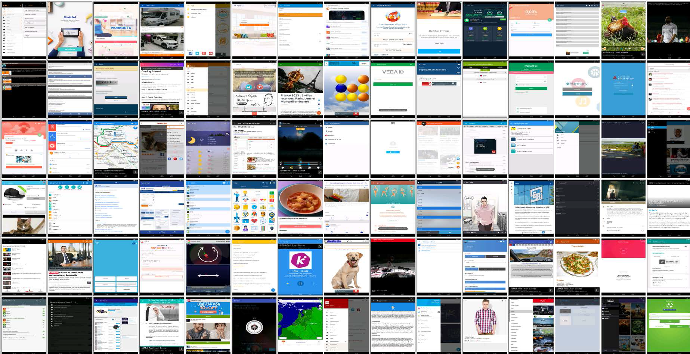

Wireframe-Based UI Design Search Through Image Autoencoder
============================================================

## Resource

- Paper: [paper](./tosem2020-uisearch-jieshan.pdf), [ACM-TOSEM](https://dl.acm.org/doi/abs/10.1145/3391613)
- Raw Dataset: [Dropbox](https://www.dropbox.com/sh/kfkhevxykzwputb/AAAhL6ipmOg4zZn4jUL_myF0a?dl=0)
- Wireframe Dataset: Please use [this wirification code](./code/wirification.py) to generate the wireframe dataset from the raw dataset
- Code: see [code](./code)

## Video DEMO

<b>Left-click to watch this video.</b>

The website in demo is not supported currently.

## Design Space

## Examples

Due to the large size of our automatic experiment results (which is about 45GB), we are still working on uploading these data.

## Usefulness Evaluation Examples

See [examples](./assets/Usefulness_example.pdf)

[More results](./results/Usefulness_results)
